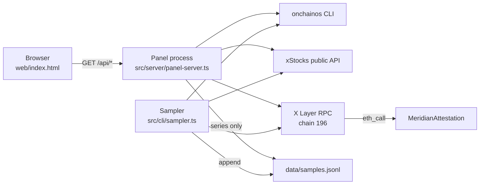
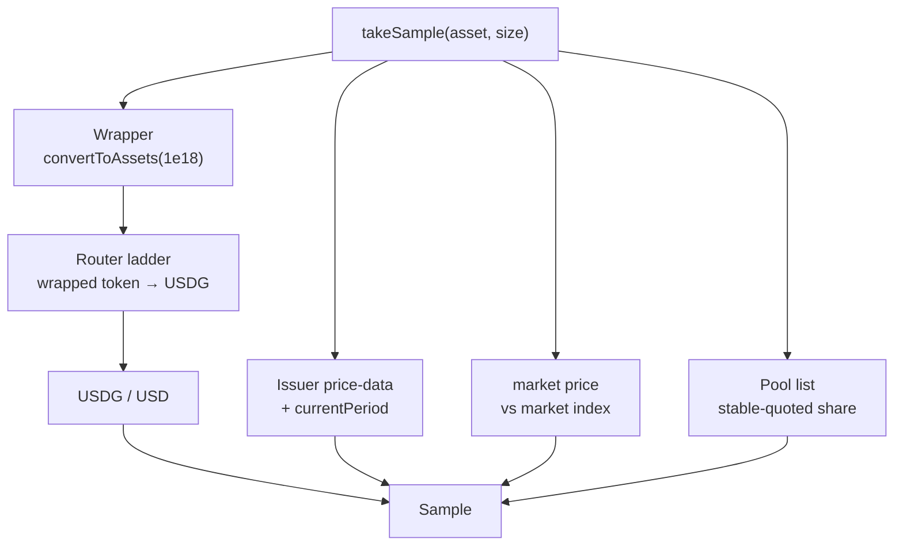
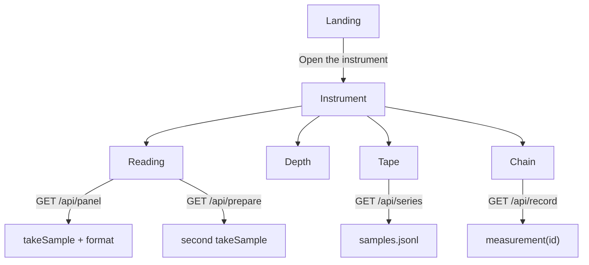
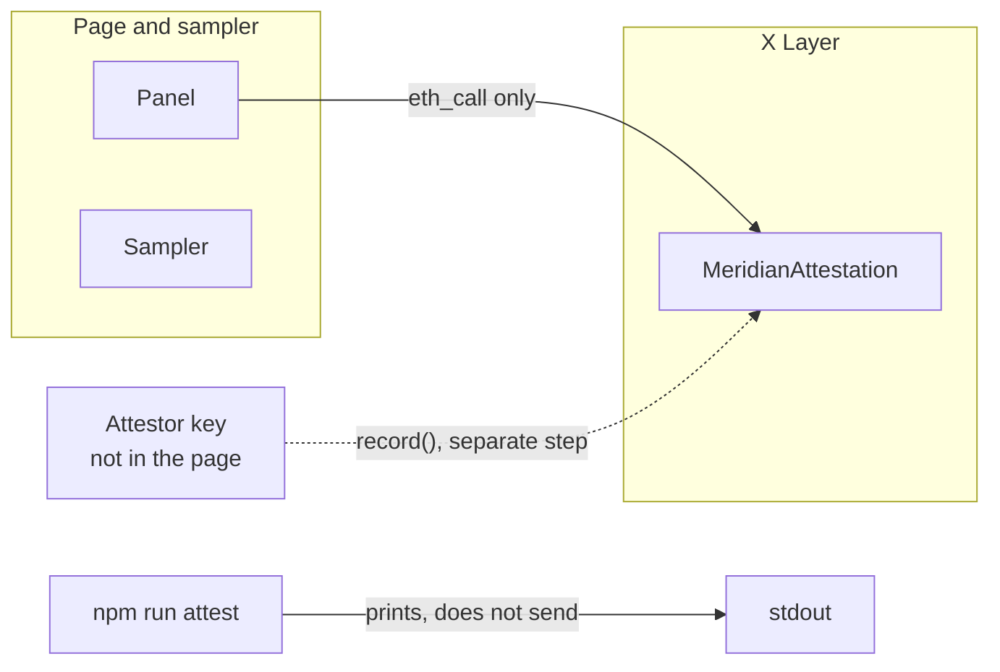

# Architecture

Meridian is a local measurement instrument. A browser asks one Node process for a
reading. That process calls the OKX CLI, the issuer's public API, and X Layer, then
returns text that was already measured. The browser does no arithmetic.

The page does not hold a key, does not sign, and does not broadcast a swap. One
dedicated attestor address can write a measurement to `MeridianAttestation`. That
address is not a user wallet, and the page never uses it.

## System



The sampler and the panel are separate processes. They share `takeSample`. Only the
sampler writes the log. A size a visitor types in would distort the continuous series,
so panel and prepare readings stay in memory.

## One reading

`takeSample` builds one `Sample`. Each feed fails on its own. A missing feed becomes a
blank and a reason. A missing wrapper rate, a missing USDG/USD parity, or a missing
issuer reference hides the comparison entirely. Nothing is defaulted to 1.



Units that matter:

| Figure | Unit |
|---|---|
| Effective price, reference, USDG/USD | USD, compared only after parity is read |
| `assetsPerShare` | Raw `convertToAssets(1e18)`, stored as a decimal string |
| Quote proceeds | USDG, 6 decimals. The LP fee is already inside `toTokenAmount` |
| Session | Issuer `currentPeriod`: market, extended, overnight, closed |

The local session clock is a cross-check. It is not the regime written down.

## The page

`GET /` serves `web/index.html`. The landing states the locked volume figures. The
instrument is four views over the same APIs. Switching a tab does not take a new sample.



| Route | What it does |
|---|---|
| `GET /api/panel?symbol&size` | One live sample. Remembered in memory, at most eight. |
| `GET /api/prepare?symbol&size&sampleId` | A new sample for the same asset and size. Refuses if it is the same sample as the panel. |
| `GET /api/series` | Rows whose `calcVersion` is `2026-09-23.3-usd-denominated`. Other versions are counted and dropped. |
| `GET /api/record` | Latest written measurement, or `?id=`. Decodes stored integers. Does not recompute a price. |

Prepare keeps four figures from the fresh quote: effective USD, minimum received (exact
router proceeds, no tolerance subtracted), the gap at the requested size, and a deadline
of 120 seconds after that sample's own timestamp. The deadline is an instant, not a
countdown drawn in the browser. State is `prepared`. Submitted, confirmed, failed, and
dropped are not states this page has, because it does not send a transaction.

## What gets written, and what does not



The contract accepts one writer. A record stores the bare token, effective and reference
prices in USD at 1e8, the USDG/USD parity at 1e8, the raw wrapper rate, size in bare
tokens at 1e18, the issuer regime, two timestamps, and `sourcesHash`.

`sourcesHash` is `keccak256(abi.encode(...))` of six source identifiers, in order:
calculation version, CLI version, reference URL, router quote id (empty when the router
returns none), wrapper address, USDG address. It binds the setup that produced the
record. It does not bind the prices; those sit in the clear.

A sample with an unverified wrapper rate, an unknown session, a missing reference, or a
missing parity is not a record. The contract also rejects those zeros.

Deployment: chain 196, `0x1246cD8Ef1a87B0F984Eb395023e7e23C70aD267`. See
`deployments/xlayer.json`.

## Layout

```
web/index.html              landing and instrument
src/server/panel-server.ts  HTTP only
src/core/sample.ts          one observation
src/core/quotes.ts          router ladder
src/core/quote-token.ts     USDG/USD, never defaulted to 1
src/core/panel.ts           sample → text, no new arithmetic
src/core/prepare.ts         second sample vs the panel sample
src/core/series.ts          one calc version
src/core/record.ts          decode a stored measurement
src/core/attest.ts          sample → Measurement, or a refusal
src/cli/                    probe, sample, sampler, attest, volume study
contracts/MeridianAttestation.sol
```

## Boundaries

- The view layer renders fields. It does not derive a price, a gap, or a parity.
- USDG amounts are never copied into USD fields. If parity is missing, USD is blank.
- The wrapper rate is never assumed to be 1. If `convertToAssets` cannot be read, the
  comparison is withheld.
- An unknown issuer period is refused, not guessed.
- Panel and prepare samples are not appended to `data/samples.jsonl`.
- Older calculation versions stay in their quarantine files and are not mixed into the
  series.
